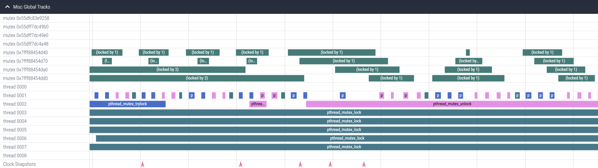

# pthread_trace
This tool allows capturing pthread events into a [perfetto](https://perfetto.dev/) trace, which allows visualizing pthread synchronization events on a timeline for debugging and optimization purposes.

To use it, compile the tool to a shared library:
```
c++ -shared -fPIC -ldl -O2 -DNDEBUG -std=c++14 pthread_trace.cc -o pthread_trace.so
```

Then, run your program with `pthread_trace.so` as an LD_PRELOAD:
```
PTHREAD_TRACE_PATH=trace.proto LD_PRELOAD=$(pwd)/pthread_trace.so <pthread using program> <program arguments...>
```

Now, navigate to [ui.perfetto.dev](https://ui.perfetto.dev), and load the resulting trace.proto file.

## Traced events
This tool captures the following information:
- Time threads are blocked in `pthread_mutex_lock`
- Time threads are blocked in `pthread_cond_wait`, `pthread_cond_timedwait`
- Time threads are blocked in `pthread_once`
- Time threads are blocked in `pthread_join`
- Time yielded via `sched_yield`, `sleep`, `usleep`, `nanosleep`
- Time threads hold a mutex (i.e. time between `pthread_mutex_lock` or a successful `pthread_mutex_trylock` and `pthread_mutex_unlock`)
- `pthread_cond_broadcast` and `pthread_cond_signal` calls

### Examples

#### Thread pool end to end
This trace is of a program that starts a simple thread pool, runs a very small group of extremely fine grained tasks, and then shuts down:


#### Dequeuing tasks in a thread pool
This trace is of a more realistic workload, showing threads completing tasks (the empty spaces in traces generated by pthread_trace) and dequeuing the next tasks to work on:


#### `std::lock` of 4 mutexes
Here is a look at [`std::lock`](https://en.cppreference.com/w/cpp/thread/lock)'s deadlock avoidance algorithm in action:



## How it works
This works by providing wrapper implementations of the various pthreads APIs that add tracing logic.
Traces are accumulated in a thread-local buffer before being flushed to the trace file.
The trace file is a circular buffer of blocks.
When the trace file fills up, the oldest blocks will be overwritten by newer blocks.
The size of the trace file circular buffer can be controlled with the `PTHREAD_TRACE_BUFFER_SIZE_KB` environment variable.

## Tracing overhead
While this project makes some effort to reduce tracing overhead, even very lightweight tracing will be significant compared to uncontended thread synchronization primitives.
It is possible (likely even) that enabling this tracing tool will alter the behavior of programs using pthreads.
It might only slow the program down, but it could dramatically alter the behavior of synchronization primitives.
